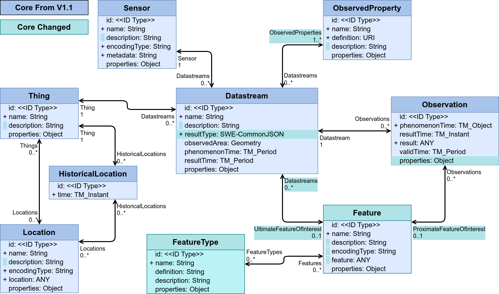

[[sensing-entities]]
=== Sensing Entities

All data model requirements classes are grouped in the following requirements class:

[requirements_class]
.Sensing Entities

====
[%metadata]
identifier:: {identifier}/req-class/datamodel/sensing
obligation:: requirement
subject:: Target Type: Data Model
requirement:: {identifier}/req-class/datamodel/sensing/thing
requirement:: {identifier}/req-class/datamodel/sensing/location
requirement:: {identifier}/req-class/datamodel/sensing/historical-location
requirement:: {identifier}/req-class/datamodel/sensing/datastream
requirement:: {identifier}/req-class/datamodel/sensing/sensor
requirement:: {identifier}/req-class/datamodel/sensing/observed-property
requirement:: {identifier}/req-class/datamodel/sensing/observation
requirement:: {identifier}/req-class/datamodel/sensing/feature  
====

The OGC SensorThings API (2.0) standard depicts the Core Sensing entities in Figure 1  
[#img-sta-core,link=../images/GRP0001.png]
  
[.text-center]  
.Figure 1. Sensing Core

In this section, we define each entity depicted in Figure 1 and its relationships with other entities. Additionally, we also provide examples to model the entities in different contexts.  

==== Requirement Class: Thing

[requirements_class]
.Thing

====
[%metadata]
identifier:: {identifier}/req-class/datamodel/sensing/thing
obligation:: requirement
subject:: Target Type: Data Model
requirement:: {identifier}/req/datamodel/sensing/thing/properties
requirement:: {identifier}/req/datamodel/sensing/thing/relations
====

The SensorThings API follows the ITU-T definition, i.e., with regard to the Internet of Things, a thing is an object of the physical world (physical things) or the information world (virtual things) that is capable of being identified and integrated into communication networks [ITU-T Y.2060].

[example%unnumbered]
====
*Thing Examples*

- A weather forecasting facility that houses multiple weather sensors deployed across several sites
- A drone that mounts a LiDAR sensor for mapping purposes
- An upstream oil well that is equipped with compound gas detection devices
====

[additional-notes]
====
*NOTE*: The Thing entity draws from the Host interface from the Conceptual Observation Schema in OMS

====

[requirement]
====
[%metadata]
identifier:: {identifier}/req/datamodel/sensing/thing/properties

Each Thing entity SHALL have the mandatory properties and MAY have the optional properties listed in Table 1.
====
[#thing-properties,reftext='{table-caption} {counter:table-num}']
.Properties of a Thing entity
[width="100%",cols="5,17,3,3,3",options="header"]
|====
| *Name*               | *Definition* | *Data Type* | *Usage* | Multiplicity
| `name`               | A property provides a label for Thing entity, commonly a descriptive name. | String | Required | One
| `description`        | This is a short description of the corresponding Thing entity. | String | Required | One
| `properties`         | A JSON Object containing user-annotated properties as key-value pairs. | JSON Object | Optional | Zero to One
|====

[requirement]
====
[%metadata]
identifier:: {identifier}/req/datamodel/sensing/thing/relations
Each Thing entity SHALL have the direct relation between a Thing entity and other entity types listed in Table 2.
====

[#thing-relations,reftext='{table-caption} {counter:table-num}']
.Direct relation between a Thing entity and other entity types
[width="100%",cols="5,5,10,10",options="header"]
|====
| *Entity Name*              | *Role* | *Multiplicity* | *Description*
| `Location`         | Locations | Many optional to many optional | The Location entity locates the Thing. Multiple Things MAY be located at the same Location. A Thing MAY not have a Location. A Thing SHOULD have only one Location.
However, in some complex use cases, a Thing MAY have more than one Location representations. In such case, the Thing MAY have more than one Locations. These Locations SHALL have different encodingTypes and the encodingTypes SHOULD be in different spaces (e.g., one encodingType in Geometrical space and one encodingType in Topological space).
| `HistoricalLocation`        | HistoricalLocations | One mandatory to many optional | A Thing has zero-to-many HistoricalLocations. A HistoricalLocation has one-and-only-one Thing.
| `Datastream`  | Datastreams | One mandatory to many optional | A Thing MAY have zero-to-many Datastreams.
|====
