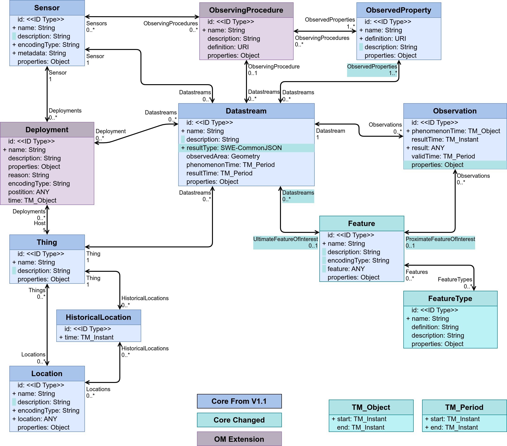

[[sensing-OM-extension]]
=== Sensing Extension (Observations & Measurements)

All Sensing Extension (Observations & Measurements) requirements classes are grouped in the following requirements class:

[requirements_class]
.Sensing Extension (Observations & Measurements) Entities

====
[%metadata]
identifier:: {identifier}/req-class/datamodel/sensing-extension-om
obligation:: requirement
subject:: Target Type: Data Model
requirement:: {identifier}/req-class/datamodel/sensing/deployment
requirement:: {identifier}/req-class/datamodel/sensing/observing-procedure
====

The Sensing Extension (Observations & Measurements) is described by the entities in Figure {counter:figure-num}
[#img-sta-core,link=../images/GRP0002.png]
  
[.text-center]  
.Figure . Sensing Extension (Observations & Measurements)

==== Requirement Class: Deployment

[requirements_class]
.Deployment

====
[%metadata]
identifier:: {identifier}/req-class/datamodel/sensing/deployment
obligation:: requirement
subject:: Target Type: Data Model
requirement:: {identifier}/req/datamodel/sensing/deployment/properties
requirement:: {identifier}/req/datamodel/sensing/deployment/relations
====

A Deployment is the association of Sensors to the Thing that hosts them and produces Datastreams from the associated Sensors. The Deployment entity is optional and the standard does not mandate defining the entity when modelling sensing applications.

[requirement]
====
[%metadata]
identifier:: {identifier}/req/datamodel/sensing/deployment/properties

Each Deployment entity SHALL have the mandatory properties and MAY have the optional properties listed in Table {counter:table-num}.
====

[requirement]
====
[%metadata]
identifier:: {identifier}/req/datamodel/sensing/deployment/relations

Each Deployment entity SHALL have the direct relation between a Deployment entity and other entity types listed in Table {counter:table-num}.
====

[#deployment-properties,reftext='{table-caption} {counter:table-num}']
.Properties of a Deployment entity
[width="100%",cols="5,17,3,3,3",options="header"]
|====
| *Name*               | *Definition*                                                                                     | *Data Type*                                    | *Usage*  | *Multiplicity*
| `name`               | A property provides a label for Deployment entity, commonly a descriptive name.                  | String                                         | Required | One
| `description`        | The description of the Deployment entity.                                                        | String                                         | Optional | Zero-to-one
| `properties`         | A JSON Object containing user-annotated properties as key-value pairs                            | JSON Object                                    | Optional | Zero-to-one
| `position`           | The detailed description of the Sensor or system. The metadata type is defined by encodingType   | String                                         | Required | One
| `deploymentTime`     | The time instant or period of when the Sensors are deployed and they start producing Datastreams | TM_Object (ISO 8601 Time string or Time Interval string) | Optional | Zero-to-one         
|====

[#deployment-relations,reftext='{table-caption} {counter:table-num}']
.Direct relation between a Deployment entity and other entity types
[width="100%",cols="5,5,10,10",options="header"]
|====
| *Entity Name*               | *Role*                                 | *Multiplicity*                   | *Description*
| `Sensor`                    | Sensor                                 | Many optional to one mandatory   | A Deployment deploys one-to-many Sensors in order to maintain information regarding the relative position of the Sensor with respect to the Host (Thing) and to record its deploymentTime. If a sensor is redeployed on to the same Host again and the same Datastream needs to be reused, the same Deployment entity SHALL be reused
| `Datastream`                | Datastreams                            | One optional to many optional    | The Deployment entity MAY be used to indicate the current state of the zero-to-many Datastreams, whether it is still open or the deploymentTime has expired
| `Thing`                     | Host                                   | Many optional to one mandatory   | Each Deployment MUST be associated with one and only one Thing. The Thing has the role of the Host as it hosts the associated Sensors  
|====

[example%unnumbered]
====
*Deployment Examples*

- The assignment of an array of Sensors onto a platform within a Thing that monitors speed limit and driver distraction on a freeway
- The information pertaining to the orientation of moving Sensors when observing moving Features can be described by a Deployment
====

==== Requirement Class: ObservingProcedure

[requirements_class]
.ObservingProcedure

====
[%metadata]
identifier:: {identifier}/req-class/datamodel/sensing/observing-procedure
obligation:: requirement
subject:: Target Type: Data Model
requirement:: {identifier}/req/datamodel/sensing/observing-procedure/properties
requirement:: {identifier}/req/datamodel/sensing/observing-procedure/relations
====

[requirement]
====
[%metadata]
identifier:: {identifier}/req/datamodel/sensing/observing-procedure/properties

Each ObservingProcedure entity SHALL have the mandatory properties and MAY have the optional properties listed in Table {counter:table-num}.
====

[requirement]
====
[%metadata]
identifier:: {identifier}/req/datamodel/sensing/observing-procedure/relations

Each ObservingProcedure entity SHALL have the direct relation between an ObservingProcedure entity and other entity types listed in Table {counter:table-num}.
====

[#observing-procedure-properties,reftext='{table-caption} {counter:table-num}']
.Properties of an ObservingProcedure entity
[width="100%",cols="5,17,3,3,3",options="header"]
|====
| *Name*               | *Definition*                                                                                                                                | *Data Type*                                  | *Usage*  | *Multiplicity*
| `name`               | A property provides a label for ObservingProcedure  entity, commonly a descriptive name.                                                    | String                                       | Required | One
| `definition`         | The URI of the ObservingProcedure. Dereferencing this URI SHOULD result in a representation of the definition of the ObservingProcedure     | URI                                          | Optional | Zero-to-one
| `description`        | A description about the ObservingProcedure                                                                                                  | String                                       | Optional | Zero-to-one
| `properties`         | A JSON Object containing user-annotated properties as key-value pairs                                                                       | JSON Object                                  | Optional | Zero-to-one
|====

[#observing-procedure-relations,reftext='{table-caption} {counter:table-num}']
.Direct relation between an ObservingProcedure entity and other entity types
[width="100%",cols="5,5,10,10",options="header"]
|====
| *Entity Name*               | *Role*                                 | *Multiplicity*                   | *Description*
| `Datastream`                | Datastreams                            | One mandatory to many optional   | The ObservingProcedure can be shared by multiple Datastreams 

The Datastreams can also be partitioned by the multiple ObservingProcedures used by the same Sensor for the same ObservedProperty
| `ObservedProperty`          | ObservedProperties                     | Many optional to many mandatory  | ObservingProcedure MAY be reused for observing one-to-many ObservedProperties
| `Sensor`                    | Sensors                                | Many optional to many optional   | A Sensor MAY measure an ObservedProperty using zero-to-many ObservingProcedures
|====
