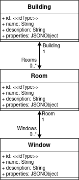
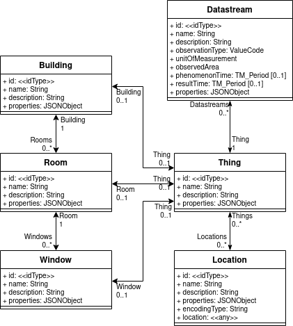
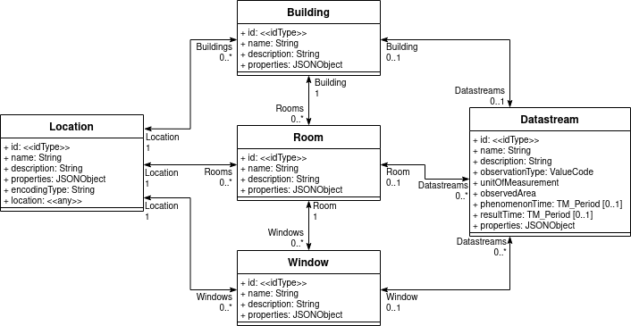
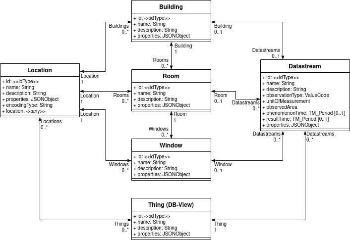

# Building Management

**Contributed by:** hylkevds - Fraunhofer IOSB

## Typical user scenario:

A campus of a large organisation has multiple buildings.
The campus has sensors measuring all sorts of observed properties in rooms, hallways and elevators, on doors and windows.
To enable complex querying it would be best to have the relations between those Things/Locations fully exposed in the data model.

An example domain data model:

### Option 1

Squeeze everything into things. 

Advantage: 
- 100% SensorThings API.

Disadvantages:
- Makes linking between different items difficult.
- Everything is in Things, not ideal for domain clients.

### Option 2

Expose the model, mirroring each entity as a Thing:

Advantage: 
- 100% SensorThings API.
- Domain clients get the full querying flexibility.

Disadvantages:
- All domain entities are duplicated, need to be maintained twice.
- There is a Thing between domain entities and their Datastreams.

### Option 3

Replace Things with entities from the model:

Advantage: 
- Perfect model for domain clients.
- Domain clients get the full querying flexibility.

Disadvantages:
- Breaks SensorThings API clients.

### Option 4

Mirror Things from domain entities, using a database view with unions.

Advantage: 
- 100% SensorThings API.
- Domain clients get the full querying flexibility.
- No data duplication.

## Actors:
List of actors that participate in the use case
1. First Actor
2. Second Actor

## Preconditions:
List of conditions required to make the use case possible
1. First precondition
2. Second precondition
3. Third precondition

## Process:
List of steps taken in completing the use case
1. First step in process
2. Second step in process
3. Third step in process

## Required input:
List of inputs required to satisfy the use case
1.	First input
2.	Second input
3.  Third input

## Output:
The list of outputs from the use case
1.	output one
2.	output two

## Extensions: 
List of extensions of the use case
1.	First extention option
2.	Second extension option

